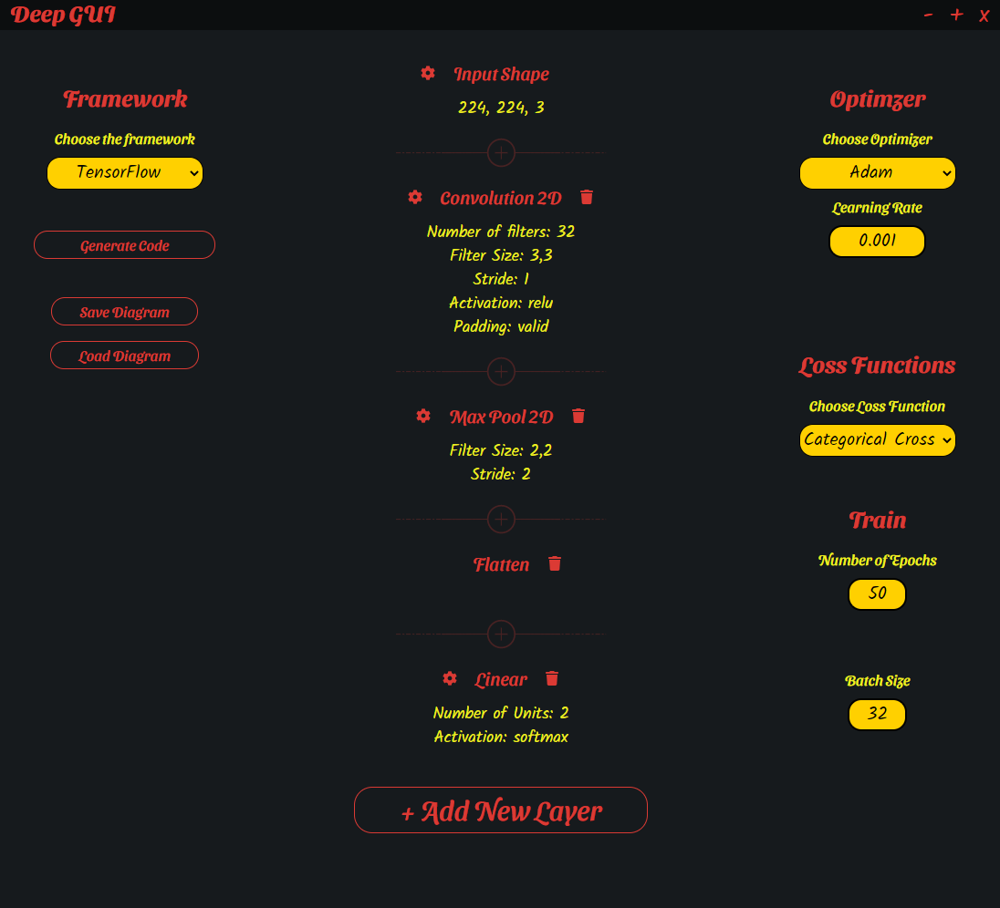
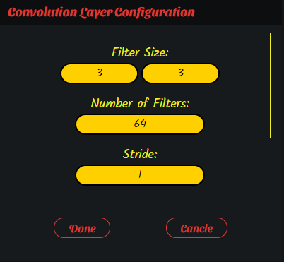
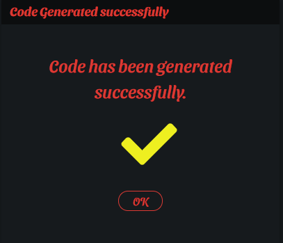
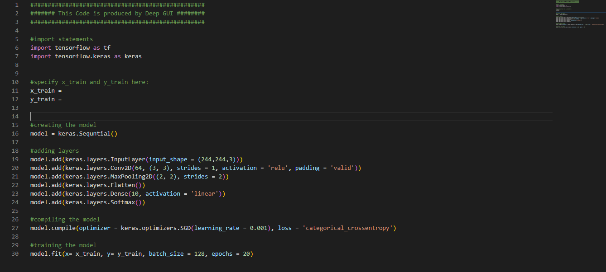

# DeepGUI
## What is DeepGUI
DeepGUI is a graphical user interface which generates Deep Learning Frameworks codes for you. You can just add, remove, and edit layers in a graphical way and the interface generates python code for you. Cool, ha?

DeepGUI is built using Electron.js framework.

## DeepGUI 0.1.0 is OUT!
The specifications of this version:
+ These layers are available in this version:
    - Dense,
    - Convolution (1D, 2D, and 3D) layers,
    - Pooling (Max and Average) (1D, 2D, and 3D)
    - RNN, LSTM, and GRU layers,
    - Embedding layer,
    - Batch Normalization layer,
    - Flatten layer,
    - Dropout layer,
    - and Activation layer.

+ Only TensorFlow framework is accessible. PyTorch will be added soon.
+ Basic configurations of each layer is added. Advanced configurations will be added soon.
+ Only Sequential  models are available in this version.

## The latest version of the DeepGUI
The latest version of DeepGUI has these added specifications:
+ Now you can add new layers in between of other layers.

## Some Screenshots of the GUI
I provide some of the screenshots of the GUI here. I know that this configuration is not OK for a 10-class image dataset classification. It's just a simple example.
### Main Window

  

### Convolutions Configurations

  

### Successful Generation of Code

  

### Generated Code

  

